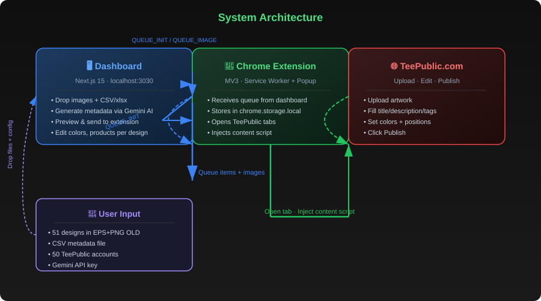
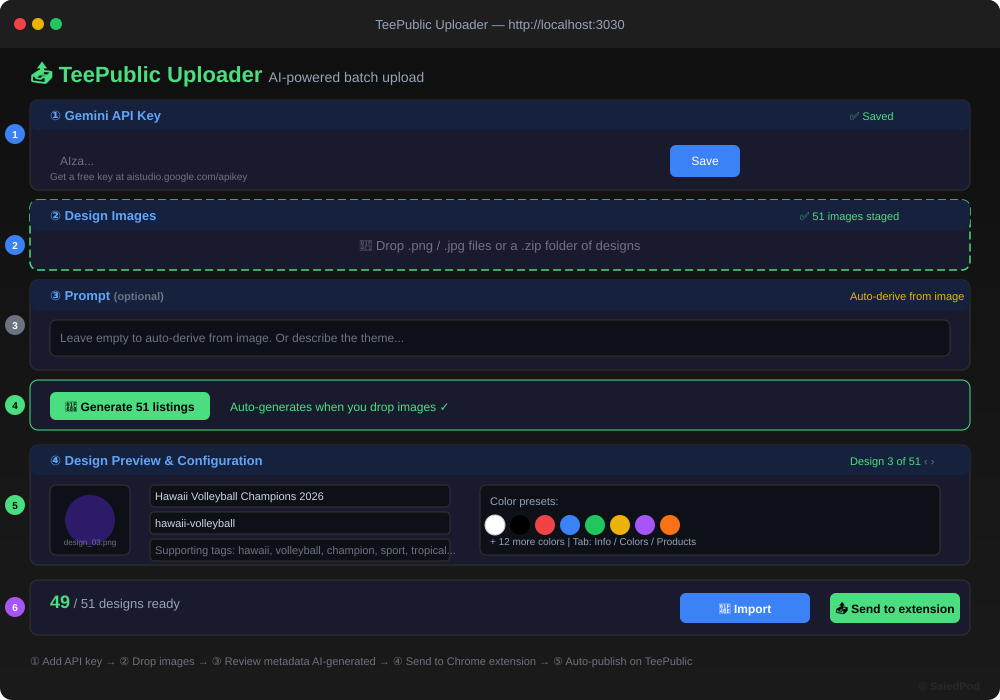
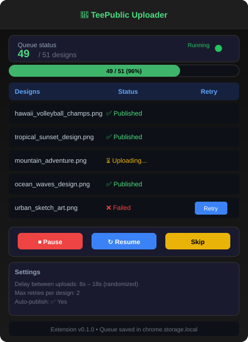
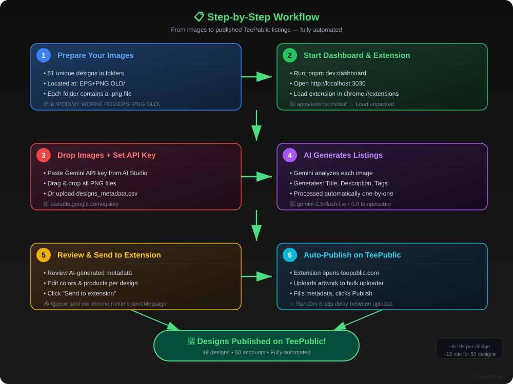

# 🧩 TeePublic Uploader

**رفع وتحميل جماعي لتصاميم TeePublic مع الذكاء الاصطناعي**  
AI-powered batch upload manager for [TeePublic](https://www.teepublic.com) — from images to published listings automatically.

[](https://github.com/saiedpod-bot/teepublicUpload/actions/workflows/build-extension.yml)
[](https://github.com/saiedpod-bot/teepublicUpload/actions/workflows/release.yml)



---

## 📋 Overview | نظرة عامة

This project automates the entire workflow of uploading designs to TeePublic:

| Step | Description |
|:----:|-------------|
| **①** | Drop your PNG designs |
| **②** | Gemini AI generates title, description & tags from each image |
| **③** | Chrome extension uploads & publishes on TeePublic automatically |
| **④** | Randomized delays (8-18s) between uploads to avoid detection |

---

## 📸 Screenshots | صور الواجهة

### Dashboard Interface | واجهة التحكم

*Main dashboard at localhost:3030 — drop images, AI generates, send to extension*

### Extension Popup | نافذة الإضافة

*Chrome extension showing queue progress, retries, and publish status*

### Workflow | سير العمل

*Complete 6-step automated workflow from images to published listings*

---

## 🚀 Quick Start | البداية السريعة

### Prerequisites | المتطلبات

- Node.js 20+
- pnpm 9+
- Chrome browser
- TeePublic account(s)
- Gemini API key ([get free](https://aistudio.google.com/apikey))

### 1️⃣ Install & Run | التثبيت والتشغيل

```bash
# Install dependencies
pnpm install

# Build the extension
pnpm build:extension

# Start the dashboard (http://localhost:3030)
pnpm dev:dashboard
```

### 2️⃣ Load Extension in Chrome | تحميل الإضافة

1. Open **chrome://extensions**
2. Toggle **Developer mode** (top right)
3. Click **Load unpacked** → select `apps/extension/dist`
4. Copy the **Extension ID** shown on the card

### 3️⃣ Use It | الاستخدام


| Step | Action | Details |
|:----:|--------|---------|
| **1** | **Get API key** | Get free key from [aistudio.google.com/apikey](https://aistudio.google.com/apikey) — use **AI Studio key** (not Google Cloud Console) |
| **2** | **Open dashboard** | Go to `http://localhost:3030`, paste extension ID |
| **3** | **Drop images** | Drag & drop all `.png` files from your design folder |
| **4** | **AI generates** | Gemini automatically creates title, description, tags for each image |
| **5** | **Review (optional)** | Edit metadata, colors, products per design |
| **6** | **Send to extension** | Click "Send to extension" — queue is transferred |
| **7** | **Auto-publish** | Extension opens TeePublic, uploads artwork, fills fields, clicks Publish |

---

## 🔑 Keys, Permissions & Requirements | المفاتيح والصلاحيات المطلوبة

### Required

| Item | Type | Where to Get | Permissions Needed |
|------|------|-------------|-------------------|
| **Gemini API Key** | 🔑 API key | [aistudio.google.com/apikey](https://aistudio.google.com/apikey) | **AI Studio key** (NOT Google Cloud Console) — works immediately with free tier |
| **TeePublic Account** | 👤 Login | [teepublic.com](https://www.teepublic.com) | Must be **logged in** in Chrome profile where extension runs |
| **Chrome Browser** | 🌐 Browser | [google.com/chrome](https://www.google.com/chrome/) | MV3 extension support required |
| **Node.js 20+** | ⚙️ Runtime | [nodejs.org](https://nodejs.org/) | For dashboard + extension build |
| **pnpm 9+** | 📦 Package manager | `npm i -g pnpm` | For monorepo dependency management |

### Chrome Extension Permissions (auto-granted when loaded)

| Permission | Reason |
|-----------|--------|
| `storage` | Save queue progress locally |
| `unlimitedStorage` | Store large design images |
| `tabs` | Open/manage TeePublic tabs |
| `scripting` | Inject content scripts into teepublic.com |
| `host_permissions: *.teepublic.com` | Access TeePublic upload pages |
| `host_permissions: localhost:3030` | Receive queue from dashboard |

### File System Access

| Path | Purpose |
|------|---------|
| `E:\POD\MY WORKE POD\EPS+PNG OLD\` | Source PNG design files (51 designs) |
| `designs_metadata.csv` | Metadata file (filename, title, tags) |
| `apps/extension/dist/` | Built extension (load unpacked from here) |

### Network Access (Firewall / Proxy)

| Destination | Port | Purpose |
|------------|------|---------|
| `generativelanguage.googleapis.com` | 443 | Gemini AI API calls |
| `teepublic.com` | 443 | Upload & publish designs |
| `localhost` | 3030 / 3031 | Dashboard / standalone server |
| `registry.npmjs.org` | 443 | Package installation (one-time) |

### ⚠️ Common Pitfalls

| Problem | Solution |
|---------|----------|
| **Gemini 403 error** | Use AI Studio key, NOT Google Cloud Console key |
| **Supabase missing env** | Use standalone server (`node standalone/server.js`) instead of dashboard |
| **Port 3030 in use** | Kill old process: `taskkill /PID (Get-NetTCPConnection -LocalPort 3030).OwningProcess /F` |
| **pnpm build fails** | Run `pnpm approve-builds` first for esbuild + sharp |
| **Extension not connecting** | Paste correct Extension ID in dashboard from `chrome://extensions` |

---

## 📁 Project Structure | هيكل المشروع

```
teepublic-uploader/
├── apps/
│   ├── dashboard/          Next.js 15 + React 19 + Tailwind — UI at localhost:3030
│   │   ├── components/     GenerationApp, Dropzone, DesignConfigCard, ColorsEditor
│   │   ├── lib/
│   │   │   ├── gemini.ts   Gemini API client — image→listing generation
│   │   │   ├── aiSettings.ts  localStorage for API key, model, prompt
│   │   │   └── bridge.ts   Chrome extension messaging
│   │   └── middleware.ts   Supabase session gate (bypassed locally)
│   └── extension/          MV3 Chrome extension — queue processing + TeePublic automation
│       ├── src/
│       │   ├── content/    teepublic.ts — upload, fill, publish automation
│       │   ├── lib/        dom.ts (React-aware form fillers), selectors.ts
│       │   └── services/   automationEngine.ts, queueStore.ts
│       └── manifest.json
├── packages/shared/        Shared types + wire protocol (DesignMetadata, QueueBatch)
├── standalone/             Simple Node.js server (no pnpm needed)
│   ├── server.js           HTTP server on port 3031
│   └── index.html          Uploader UI — CSV + PNG + extension bridge
├── screenshots/            SVG illustrations of the system
├── designs_metadata.csv    Sample metadata for 49 designs
└── README.md               This file
```

---

## 🧠 AI Metadata Generation | توليد البيانات بالذكاء الاصطناعي

The dashboard uses **Gemini 2.5 Flash-Lite** to generate complete listings:

- **Title**: 30-70 chars, marketable and specific
- **Description**: 2-3 sentences, customer-facing
- **Primary Tag**: Single most relevant tag
- **Supporting Tags**: Exactly 8 tags, 1-3 words each
- **Mature Content**: Auto-detected

**Leave the prompt empty** — Gemini derives everything from the image automatically.

---

## 🔧 Standalone Mode (No Dashboard) | وضع مستقل بدون لوحة التحكم

If you don't want to run Next.js/Supabase:

```bash
node "standalone/server.js"
```

Then open `http://localhost:3031` — upload CSV + PNGs, the page bridges directly to the extension.

---

## 🔐 License System

This software uses an RSA-signed license file (`license.json`) to control access.

### How it works

1. **License file**: A signed JSON file containing subscriber name, expiry date, and feature permissions.
2. **RSA signature**: The file is signed with a private key (kept by SaiedPod). The app verifies using the embedded public key.
3. **Expiry check**: On every startup, the app checks the license validity and expiry.
4. **Block on expiry**: If the license is invalid, tampered, or expired, the app shows a blocking screen.

### For subscribers

Place the `license.json` file you receive from SaiedPod in:

- **Dashboard**: `apps/dashboard/public/license.json`
- **Standalone mode**: `standalone/license.json`
- **Extension root**: `license.json`

### License types

| Type | Duration | Features |
|------|----------|----------|
| Trial | 7 days | dashboard, standalone |
| Monthly | 30 days | dashboard, extension, standalone |
| Quarterly | 90 days | dashboard, extension, standalone |
| Yearly | 365 days | dashboard, extension, standalone |
| Perpetual | Unlimited | Everything |

### For license generation (admin only)

```bash
cd license-gen
npm install   # no deps needed, just node

# 1. Generate RSA key pair (one-time)
node generate-keys.js

# 2. Generate a license
node generate-license.js \
  --subscriber "client-name" \
  --duration 30 \
  --features "dashboard,extension,standalone" \
  --out ../apps/dashboard/public/license.json
```

> **Keep `keys/private.pem` secret.** Anyone with access to the private key can forge licenses.

---

## ⚙️ Configuration | الإعدادات

| Setting | Default | Description |
|---------|---------|-------------|
| `betweenItemsMinMs` | 8,000 | Min delay between uploads (ms) |
| `betweenItemsMaxMs` | 18,000 | Max delay between uploads (ms) |
| `retryMax` | 2 | Max retries per failed design |

Edit in `apps/extension/src/services/queueStore.ts`.

---

## 📝 Notes | ملاحظات

- **Use AI Studio API keys**, not Google Cloud Console keys (AI Studio keys work immediately)
- Each design is uploaded to a **separate TeePublic account**
- Each account can only have **one draft at a time**
- Login uses `form.requestSubmit(btn)` — standard `click()` is unreliable
- All processing is **local** — no data leaves your machine except to Gemini API and TeePublic

---

## 📄 License | الترخيص

**All Rights Reserved** — Copyright © 2026 **SaiedPod**

This software and all associated files are proprietary. No permission is granted
to copy, modify, distribute, or create derivative works without prior written
consent. Unauthorized use is strictly prohibited.

To obtain a license, contact: [https://github.com/saiedpod-bot](https://github.com/saiedpod-bot)
