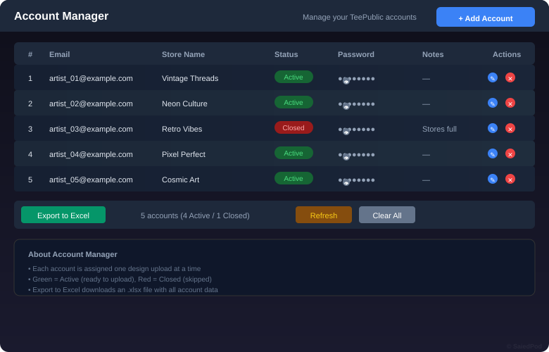

# TeePublic Uploader

AI-powered batch upload manager for [TeePublic](https://www.teepublic.com) — from images to published listings automatically.

[](https://github.com/saiedpod-bot/teepublicUpload/actions/workflows/build-extension.yml)
[](https://github.com/saiedpod-bot/teepublicUpload/actions/workflows/release.yml)


---

## Overview

This project automates the entire workflow of uploading designs to TeePublic:

| Step | Description |
|:----:|-------------|
| **①** | Drop your PNG designs |
| **②a** | AI generates title, description & tags from each image (Gemini or Vertex AI) |
| **②b** | AI generates new designs from a competitor image + title (Vertex AI Imagen) |
| **③** | Chrome extension uploads & publishes on TeePublic automatically |
| **④** | Randomized delays (8-18s) between uploads to avoid detection |
| **⑤** | Manage all your TeePublic accounts in one place with Excel export |

---

## Screenshots

### Dashboard Interface

*Main dashboard at localhost:3030 — drop images, AI generates, send to extension*

### Design Generator

*Generate new designs from competitor reference — transparent background, no watermark*

### Account Manager

*Manage TeePublic accounts with status tracking and Excel export*

### Extension Popup

*Chrome extension showing queue progress, retries, and publish status*

### Workflow

*Complete automated workflow from images to published listings*

---

## Quick Start

### Prerequisites

- Node.js 20+
- pnpm 9+
- Chrome browser
- TeePublic account(s)
- Gemini API key ([get free](https://aistudio.google.com/apikey)) — OR Google Cloud service account for Vertex AI
- Python 3.10+ (optional — for Intelligence scraper app)

### 1. Install & Run

```bash
# Install dependencies
pnpm install

# Build the extension
pnpm build:extension

# Start the dashboard (http://localhost:3030)
pnpm dev:dashboard
```

### 2. Load Extension in Chrome

1. Open **chrome://extensions**
2. Toggle **Developer mode** (top right)
3. Click **Load unpacked** → select `apps/extension/dist`
4. Copy the **Extension ID** shown on the card

### 3. Use It


| Step | Action | Details |
|:----:|--------|---------|
| **1** | **Get API key / Service Account** | Get Gemini key from [aistudio.google.com/apikey](https://aistudio.google.com/apikey) — OR set up Google Cloud Service Account for Vertex AI (no quota limits) |
| **2** | **Open dashboard** | Go to `http://localhost:3030`, paste extension ID |
| **3** | **Drop images** | Drag & drop all `.png` files from your design folder |
| **4** | **AI generates listings** | Gemini or Vertex AI automatically creates title, description, tags for each image |
| **5** | **Review (optional)** | Edit metadata, colors, products per design |
| **6** | **Generate designs (optional)** | Use "Design Generator" tab to create new designs from competitor image + title |
| **7** | **Manage accounts (optional)** | Use "Accounts" tab to store/manage TeePublic accounts with Excel export |
| **8** | **Send to extension** | Click "Send to extension" — queue is transferred |
| **9** | **Auto-publish** | Extension opens TeePublic, uploads artwork, fills fields, clicks Publish |

---

## Keys, Permissions & Requirements

### Required

| Item | Type | Where to Get | Permissions Needed |
|------|------|-------------|-------------------|
| **Gemini API Key** | API key | [aistudio.google.com/apikey](https://aistudio.google.com/apikey) | AI Studio key (NOT Google Cloud Console) — works immediately with free tier |
| **Google Cloud Service Account** | JSON key | [console.cloud.google.com](https://console.cloud.google.com/apis/credentials) | Vertex AI (Imagen + Gemini) via ADC — set `GOOGLE_APPLICATION_CREDENTIALS` env var |
| **TeePublic Account** | Login | [teepublic.com](https://www.teepublic.com) | Must be logged in in Chrome profile where extension runs |
| **Chrome Browser** | Browser | [google.com/chrome](https://www.google.com/chrome/) | MV3 extension support required |
| **Node.js 20+** | Runtime | [nodejs.org](https://nodejs.org/) | For dashboard + extension build |
| **pnpm 9+** | Package manager | `npm i -g pnpm` | For monorepo dependency management |

### Chrome Extension Permissions (auto-granted when loaded)

| Permission | Reason |
|-----------|--------|
| `storage` | Save queue progress locally |
| `unlimitedStorage` | Store large design images |
| `tabs` | Open/manage TeePublic tabs |
| `scripting` | Inject content scripts into teepublic.com |
| `host_permissions: *.teepublic.com` | Access TeePublic upload pages |
| `host_permissions: localhost:3030` | Receive queue from dashboard |

### Network Access (Firewall / Proxy)

| Destination | Port | Purpose |
|------------|------|---------|
| `generativelanguage.googleapis.com` | 443 | Gemini AI API calls |
| `us-central1-aiplatform.googleapis.com` | 443 | Vertex AI API calls (Imagen + Gemini) |
| `oauth2.googleapis.com` | 443 | Google Cloud OAuth token exchange |
| `teepublic.com` | 443 | Upload & publish designs |
| `localhost` | 3030 / 3031 | Dashboard / standalone server |
| `registry.npmjs.org` | 443 | Package installation (one-time) |

### Common Pitfalls

| Problem | Solution |
|---------|----------|
| **Gemini 403 error** | Use AI Studio key, NOT Google Cloud Console key — OR switch to "Vertex AI (Server)" mode |
| **Gemini 429 quota** | Switch to "Vertex AI (Server)" mode using Google Cloud $300 credit |
| **Supabase missing env** | Use standalone server (`node standalone/server.js`) instead of dashboard |
| **Login required** | Enter bypass code `1992` on the login screen for direct access (no account needed) |
| **Port 3030 in use** | Kill old process: `taskkill /PID (Get-NetTCPConnection -LocalPort 3030).OwningProcess /F` |
| **pnpm build fails** | Run `pnpm approve-builds` first for esbuild + sharp |
| **Extension not connecting** | Paste correct Extension ID in dashboard from `chrome://extensions` |

---

## Project Structure

```
teepublic-uploader/
├── apps/
│   ├── dashboard/          Next.js 15 + React 19 + Tailwind — UI at localhost:3030
│   │   ├── components/     GenerationApp, DesignGenerator, AccountManager, Dropzone
│   │   ├── lib/
│   │   │   ├── gemini.ts       Gemini API client — image listing generation
│   │   │   ├── vertexClient.ts Vertex AI client — ADC auth via service account JWT
│   │   │   ├── imageGen.ts     Image generation client (calls server API route)
│   │   │   ├── removeBg.ts     Client-side canvas-based background removal
│   │   │   ├── accounts.ts     TeePublic account CRUD + Excel export
│   │   │   ├── bypassAuth.ts   Login bypass code (1992) for direct access
│   │   │   ├── aiSettings.ts   localStorage for API key, model, prompt
│   │   │   └── bridge.ts       Chrome extension messaging
│   │   ├── app/api/
│   │   │   ├── generate-design/  Server API — Vertex AI Imagen image generation
│   │   │   └── generate-listing/ Server API — Vertex AI Gemini listing generation
│   │   └── middleware.ts      Supabase session gate (bypassed locally)
│   ├── intelligence/         Python AI scraper + classifier + search
│   │   ├── app.py            Flask dashboard (localhost:5000)
│   │   ├── scraper.py        TeePublic scraper
│   │   ├── classify_tshirts.py  Gemini-based vision classifier
│   │   └── ingest_to_qdrant.py  Qdrant vector search ingestion
│   └── extension/            MV3 Chrome extension — queue processing + TeePublic automation
│       ├── src/
│       │   ├── content/    teepublic.ts — upload, fill, publish automation
│       │   ├── lib/        dom.ts (React-aware form fillers), selectors.ts
│       │   └── services/   automationEngine.ts, queueStore.ts
│       └── manifest.json
├── packages/shared/        Shared types + wire protocol (DesignMetadata, QueueBatch)
├── standalone/             Simple Node.js server (no pnpm needed)
│   ├── server.js           HTTP server on port 3031
│   └── index.html          Uploader UI — CSV + PNG + extension bridge
├── screenshots/            SVG illustrations of the system
├── designs_metadata.csv    Sample metadata for 49 designs
└── README.md               This file
```

---

## AI Features

### Listing Generation

The dashboard generates complete TeePublic listings from design images:

| Method | Auth | Limits | Tab |
|--------|------|--------|-----|
| **Gemini API Key** (Browser) | API key from AI Studio | Free tier quota (429 errors) | Generate with AI |
| **Vertex AI** (Server) | ADC via Service Account | Uses Google Cloud $300 credit — no quota limits | Generate with AI |

Toggle between methods in the "Generate with AI" tab. Output:
- **Title**: 30-70 chars, marketable and specific
- **Description**: 2-3 sentences, customer-facing
- **Primary Tag**: Single most relevant tag
- **Supporting Tags**: Exactly 8 tags, 1-3 words each
- **Mature Content**: Auto-detected

Leave the prompt empty — AI derives everything from the image automatically.

### Design Generation

The **Design Generator** tab creates new t-shirt designs from a competitor reference:

1. Upload a competitor design image (optional)
2. Enter a title/theme description
3. Choose how many designs to generate (1-8)
4. AI generates unique designs via **Vertex AI Imagen 3.0**
5. Background is **automatically removed** from each result
6. Download individual designs or all at once

Prompt: `t-shirt design, no background, no watermark, flat vector style, high contrast, printable`

### Account Manager

The **Accounts** tab lets you store and manage all your TeePublic accounts:
- Add/Edit/Delete accounts (email, password, store name, notes)
- Toggle status: **Active** (green) / **Closed** (red) with one click
- Show/hide passwords
- Export all accounts to **Excel (.xlsx)** file

---

## Standalone Mode (No Dashboard)

If you don't want to run Next.js/Supabase:

```bash
node "standalone/server.js"
```

Then open `http://localhost:3031` — upload CSV + PNGs, the page bridges directly to the extension.

---

## License System

This software uses an RSA-signed license file (`license.json`) to control access.

### How it works

1. **License file**: A signed JSON file containing subscriber name, expiry date, and feature permissions.
2. **RSA signature**: The file is signed with a private key (kept by SaiedPod). The app verifies using the embedded public key.
3. **Expiry check**: On every startup, the app checks the license validity and expiry.
4. **Block on expiry**: If the license is invalid, tampered, or expired, the app shows a blocking screen.

### For subscribers

Place the `license.json` file you receive from SaiedPod in:

- **Dashboard**: `apps/dashboard/public/license.json`
- **Standalone mode**: `standalone/license.json`
- **Extension root**: `license.json`

### License types

| Type | Duration | Features |
|------|----------|----------|
| Trial | 7 days | dashboard, standalone |
| Monthly | 30 days | dashboard, extension, standalone |
| Quarterly | 90 days | dashboard, extension, standalone |
| Yearly | 365 days | dashboard, extension, standalone |
| Perpetual | Unlimited | Everything |

### For license generation (admin only)

```bash
cd license-gen
npm install   # no deps needed, just node

# 1. Generate RSA key pair (one-time)
node generate-keys.js

# 2. Generate a license
node generate-license.js \
  --subscriber "client-name" \
  --duration 30 \
  --features "dashboard,extension,standalone" \
  --out ../apps/dashboard/public/license.json
```

> **Keep `keys/private.pem` secret.** Anyone with access to the private key can forge licenses.

---

## Configuration

| Setting | Default | Description |
|---------|---------|-------------|
| `betweenItemsMinMs` | 8,000 | Min delay between uploads (ms) |
| `betweenItemsMaxMs` | 18,000 | Max delay between uploads (ms) |
| `retryMax` | 2 | Max retries per failed design |

Edit in `apps/extension/src/services/queueStore.ts`.

---

## Notes

- Use **AI Studio API keys** for Gemini, OR **Google Cloud Service Account** (ADC) for Vertex AI
- Login bypass code **`1992`** on the auth screen — no Gmail account needed for local access
- Generated images have backgrounds **automatically removed** via canvas-based color detection
- Each design is uploaded to a **separate TeePublic account**
- Each account can only have **one draft at a time**
- Login uses `form.requestSubmit(btn)` — standard `click()` is unreliable
- All processing is **local** — no data leaves your machine except to Google AI APIs and TeePublic

---

## License

**All Rights Reserved** — Copyright 2026 **SaiedPod**

This software and all associated files are proprietary. No permission is granted
to copy, modify, distribute, or create derivative works without prior written
consent. Unauthorized use is strictly prohibited.

To obtain a license, contact: [https://github.com/saiedpod-bot](https://github.com/saiedpod-bot)
